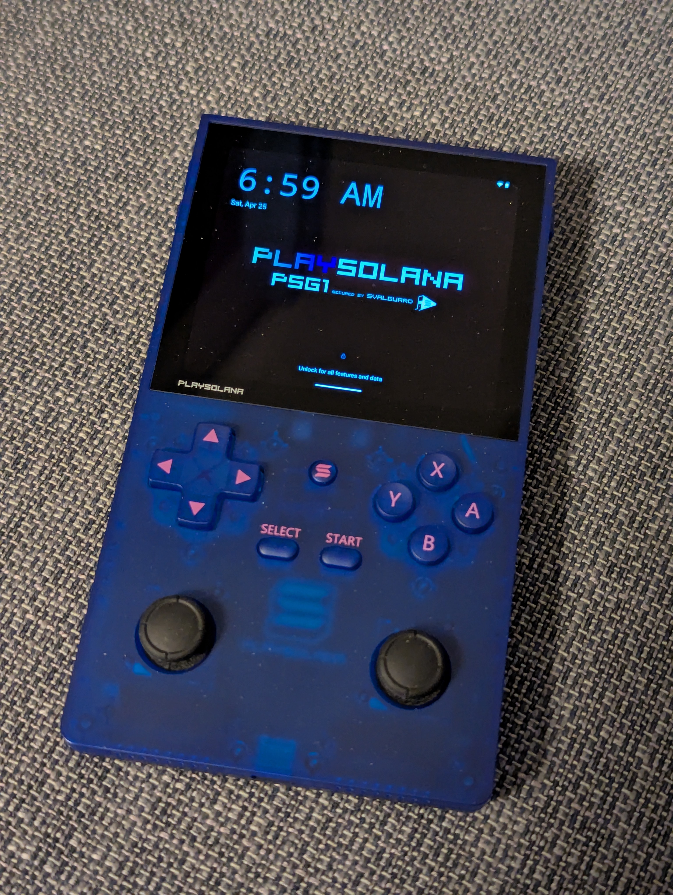
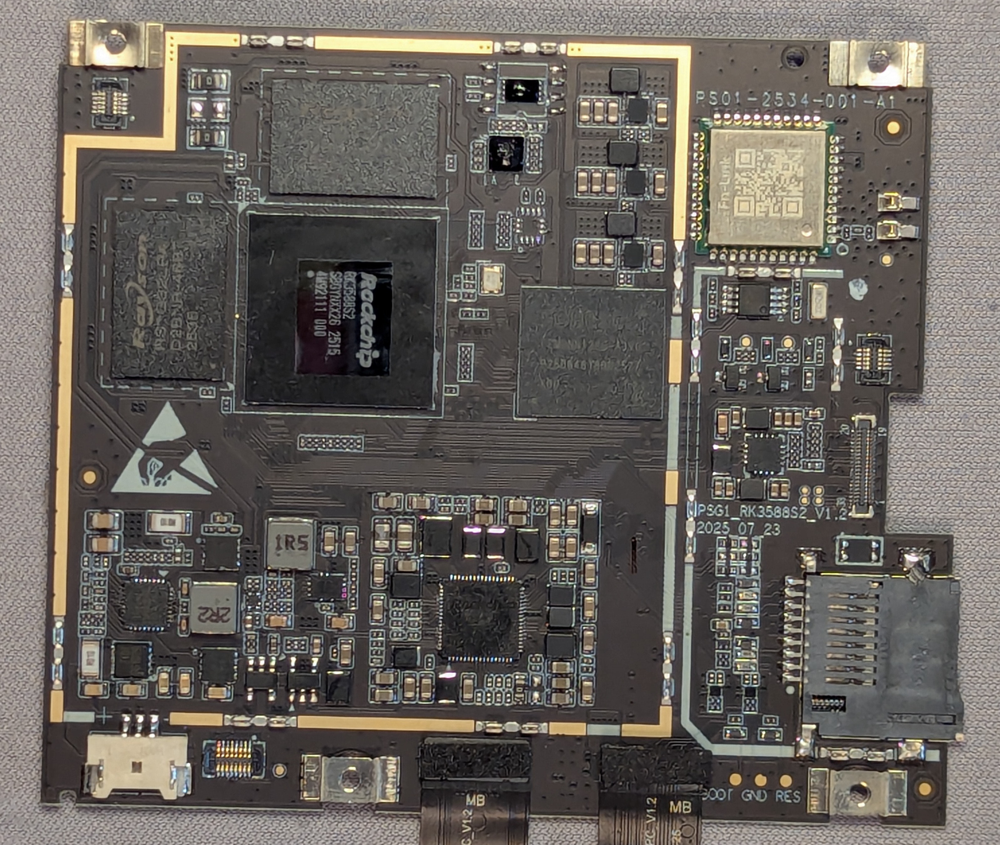

# PSG1

Website: https://www.playsolana.com/

**Specs:**
- 3.92" Multi-Touchscreen (1240 x 1080)
- Octa-Core ARM CPU (Rockchip RK3588S)
- 8GB RAM Memory LPDDR4X
- 128GB Flash Storage eMMc
- Hardware Wallet (Secured by PlaySolana SvalGuard)
- Fingerprint Reader (rear-mounted)
- WiFi 6.0 & Bluetooth 5.4
- USB-C for Charging and Video Output
- microSD card slot
- Android 15

## Pictures

## Firmware

- https://ota.playsolana.com/api/v1/{device}/{type}/{incr}
- https://ota.playsolana.com/api/v1/PSG1/release/
- https://ota.playsolana.com/builds/
